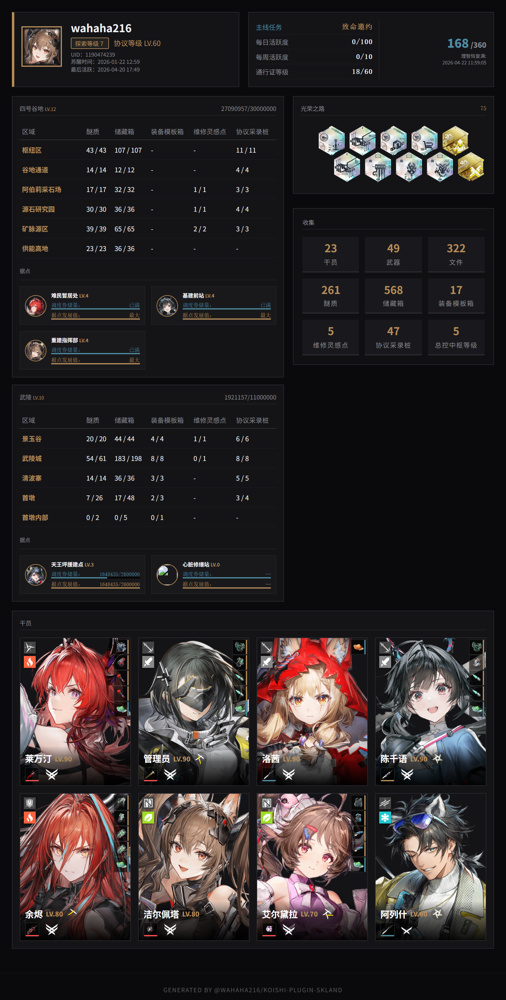
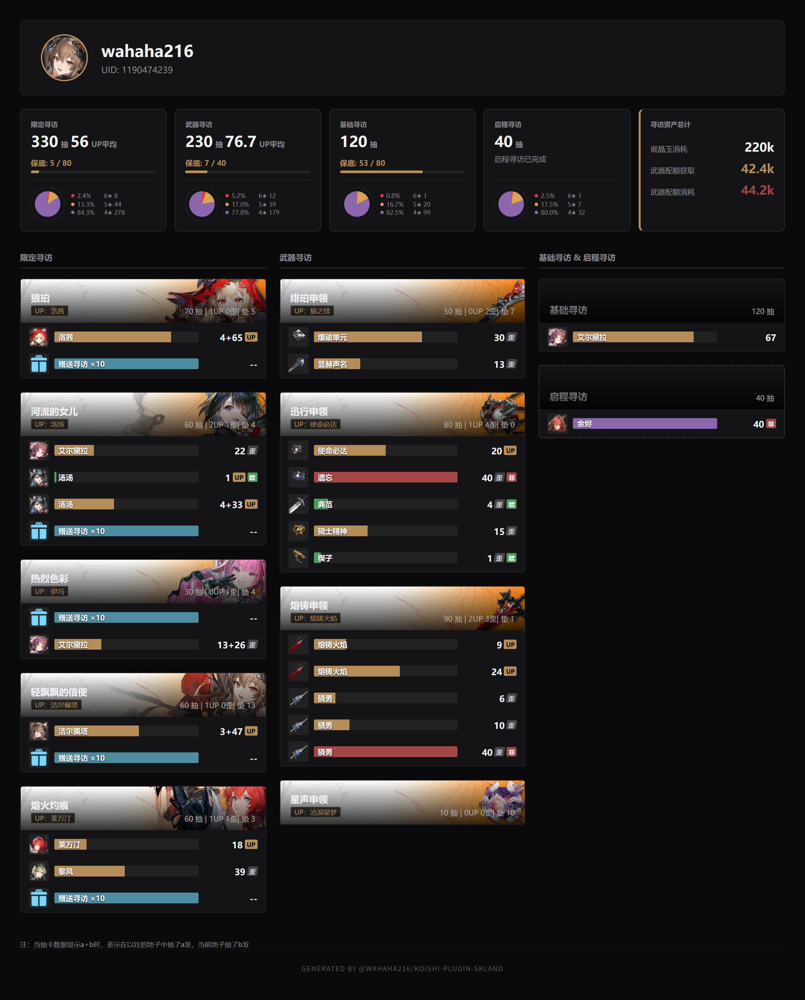

# @wahaha216/koishi-plugin-skland

[](https://www.npmjs.com/package/@wahaha216/koishi-plugin-skland)

通过森空岛查询游戏数据

## 使用方法

### 账号相关

<table>
  <tr>
    <th>指令</th>
    <th>参数</th>
    <th>参数说明</th>
    <th>指令说明</th>
  </tr>
  <tr>
    <td>skland bind qrcode</td>
    <td> - </td>
    <td> - </td>
    <td>通过二维码绑定账号</td>
  </tr>
  <tr>
    <td>skland bind &lt;token&gt;</td>
    <td> - </td>
    <td> - </td>
    <td>通过 Token 绑定账号</td>
  </tr>
  <tr>
    <td>skland unbind</td>
    <td> - </td>
    <td> - </td>
    <td>解绑账号</td>
  </tr>
  <tr>
    <td rowspan="2">autoSign</td>
    <td> -e </td>
    <td> enabled 启用自动签到 </td>
    <td rowspan="2"> 不加参数为切换自动签到状态 </td>
  </tr>
  <tr>
    <td> -d </td>
    <td> disabled 禁用自动签到 </td>
  </tr>
</table>

### 明日方舟

TODO

### 明日方舟：终末地

<table>
  <tr>
    <th>指令</th>
    <th>参数</th>
    <th>参数说明</th>
    <th>指令说明</th>
  </tr>
  <tr>
    <td>skland endfield gacha</td>
    <td> -u </td>
    <td> 更新抽卡数据 </td>
    <td> 获取抽卡分析图片，可使用@获取指定用户的抽卡分析 </td>
  </tr>
  <tr>
    <td>skland endfield gacha sync</td>
    <td> - </td>
    <td> - </td>
    <td>同步卡池信息，官方只开发UP池信息<br />该指令将从 <a href="https://github.com/FrostN0v0/EndfieldGachaPoolTable">github</a> 获取别人收集的信息</td>
  </tr>
  <tr>
    <td>skland endfield card</td>
    <td> - </td>
    <td> - </td>
    <td>获取角色卡片，可使用@获取指定用户的角色卡片</td>
  </tr>
</table>

### 手动获取 Token

**因 Token 可以访问很多敏感数据，请不要在QQ群等公共场合发送 Token**

**因 Token 可以访问很多敏感数据，请不要在QQ群等公共场合发送 Token**

**因 Token 可以访问很多敏感数据，请不要在QQ群等公共场合发送 Token**

如需绑定，推荐使用二维码进行绑定 `skland bind qrcode`

1. 打开 [森空岛网页版](https://www.skland.com/) ，并登录
2. 打开 https://web-api.skland.com/account/info/hg ，该链接会返回如下数据

```
{
    "code": 0,
    "data": {
        "content": "********************"
    },
    "msg": "接口会返回您的鹰角网络通行证账号的登录凭证，此凭证可以用于鹰角网络账号系统校验您登录的有效性。泄露登录凭证属于极度危险操作，为了您的账号安全，请勿将此凭证以任何形式告知他人！"
}
```

3. 其中的 `content` 的内容就是 Token

## 效果图

<details>

<summary>终末地角色卡片</summary>



</details>

<br />

<details>
<summary>终末地抽卡记录</summary>



</details>

## TODO

- [ ] 明日方舟相关功能（无限期搁置，毕竟退坑很久了）
- [ ] ~~想到啥写啥~~

## 已知问题

- [ ] 有时会出现 `Unauthorized` ，原因未知
- [ ] 可能存在抽卡数据保底计算错误（未测试跨多个卡池继承）
- [ ] 可能存在免费抽出6星显示异常

## 更新记录

<details>
<summary>0.1.1</summary>

1. 移除遗留的方法

2. 更改为立即执行方法

3. 适配未解锁据点

</details>

<details>
<summary>0.1.0</summary>

初版，仅实现终末地的抽卡数据和角色卡片渲染

</details>
